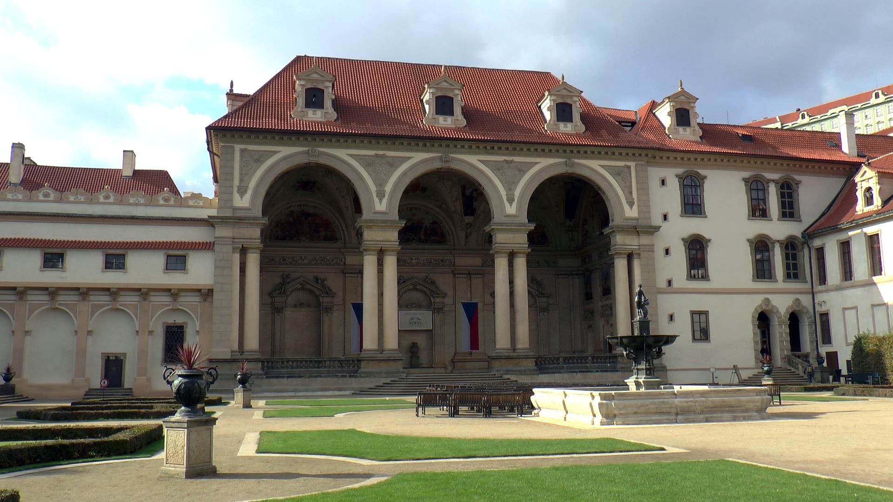
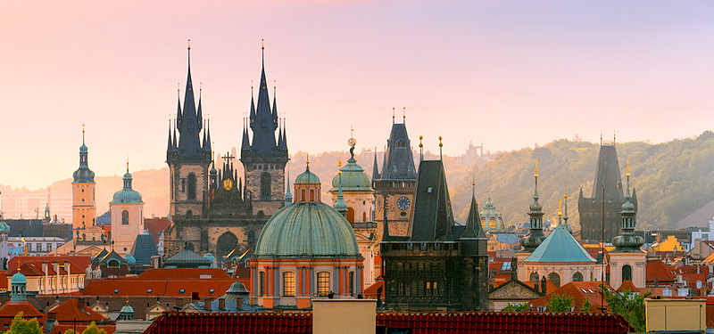
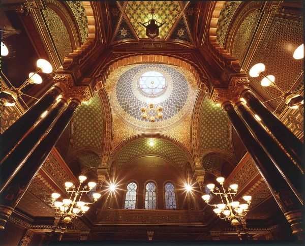
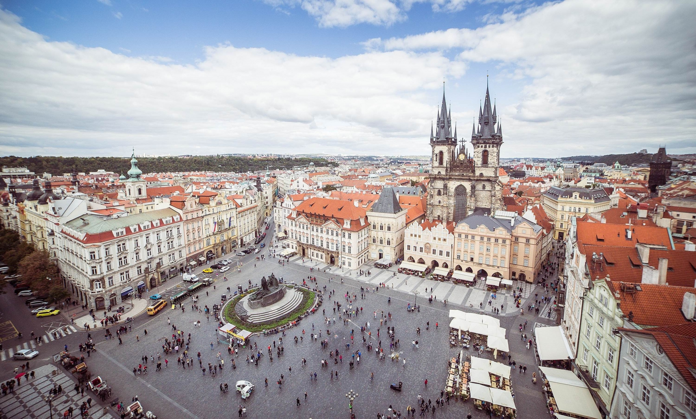
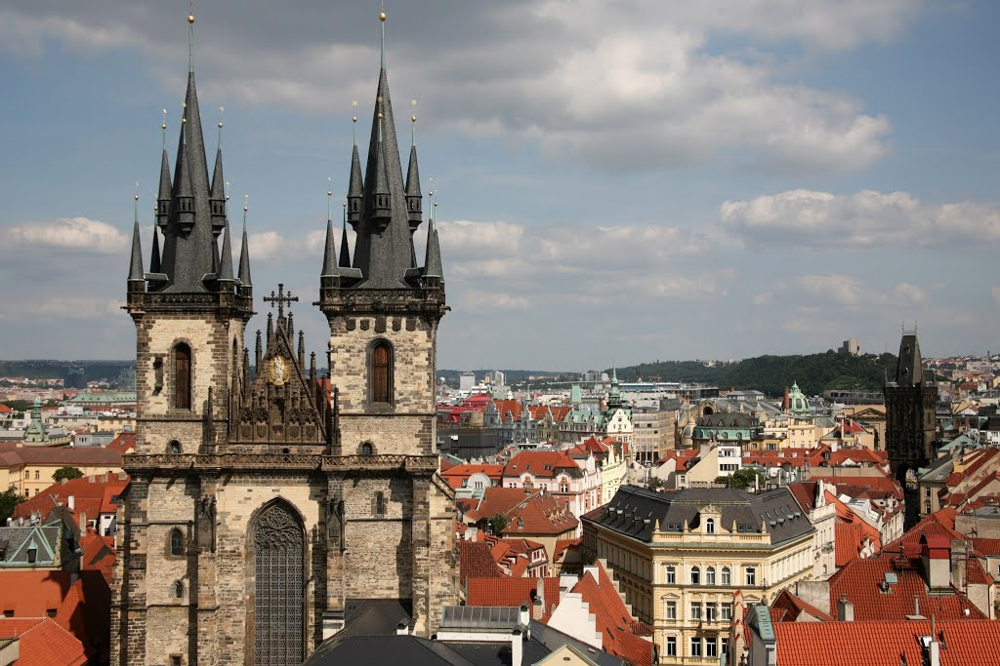
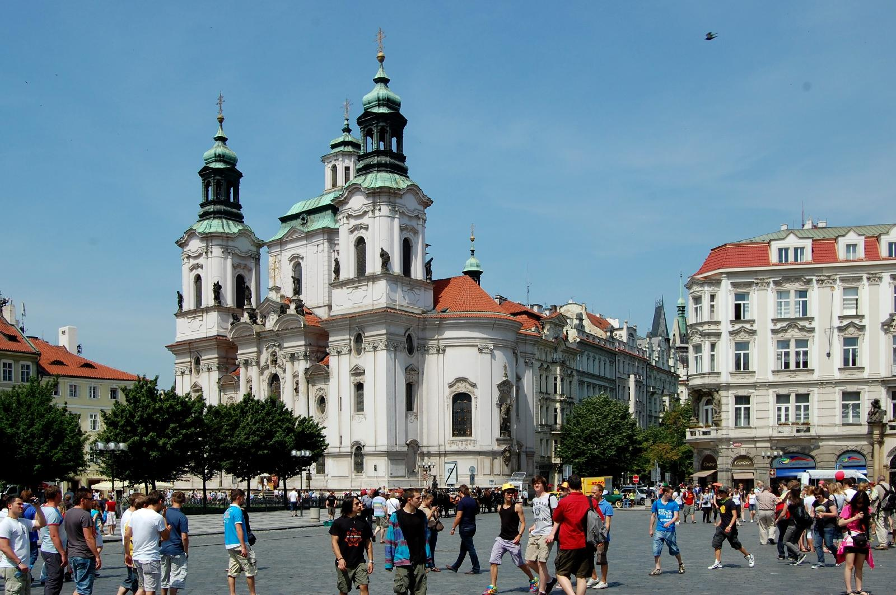

## Kennismaken met Praag

### Via Karlův Most naar toeristische dienst  

Over Karlsbrug wandelen tot aan toeristische dienst. Deze is voorbij de Malostranská mostecká věž.

### Doorheen tuinen van Vojanovy sady en Valdštejnská zahrada 

Vandaaruit kunnen we verder doorheen de parken terug naar de Oude Stad. 

### Valdštejnský paleis en Národní gallerij

### Oude Stad 

Over de Mánesův brug wandelen we terug naar de oude stad.

Voor we het oude stadsplein zien, komen we nog bezienswaardigheden tegen op rechteroever:

##### Rudolfinum

#### Starý židovský hřbitov (Joods kerkhof)

#### Kostel sv. Ducha (Kerk van Heilige Geest)

#### Spaanse synagoge

### Staroměstské náměstí (Stadsplein Oude Stad)

Bezienswaardigheden rondom het oude stadpslein.

#### Chrám Matky Boží před Týnem (Týnkerk)

#### Národní galerie (National Gallery) en Palác Kinských (Kinský paleis)

#### Chrám svatého Mikuláše (Sint-Nicolaas kerk)

#### Pražský orloj (Astronomlische klok)

