## Clam-Gallasův palác

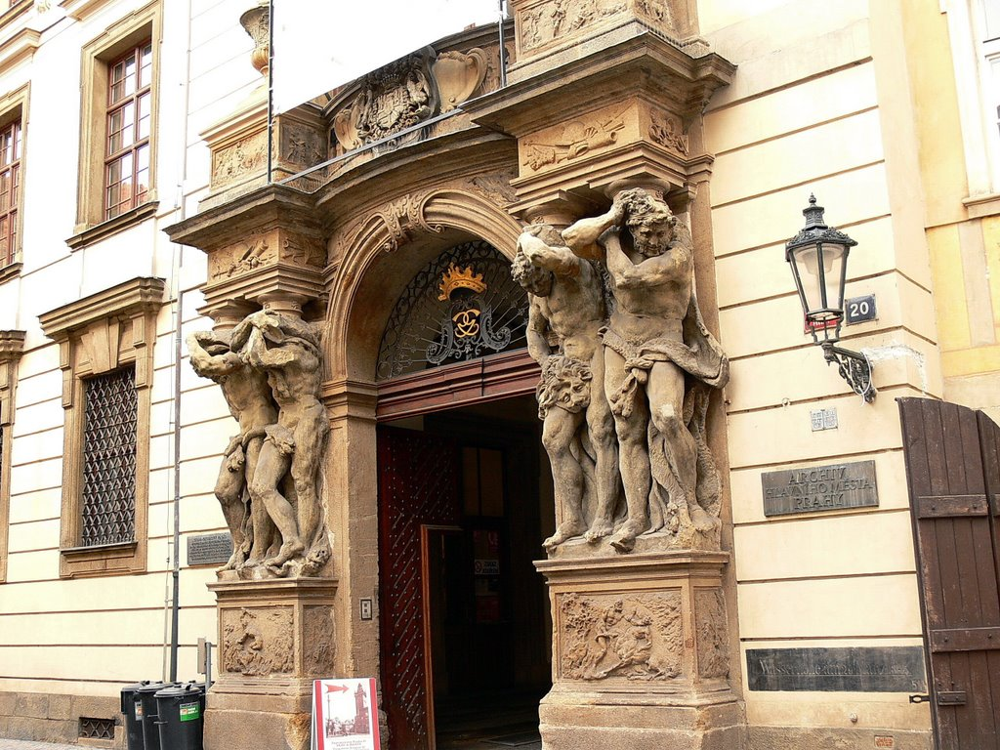

The Clam-Gallas Palace is a Baroque palace in Prague. The building is situated on the corner of Husova Street and Mariánské Square, in Prague Old Town. The palace was first designed by the imperial court architect Johann Bernhard Fischer von Erlach, from Vienna. It was built in 1714–18 by the Italian architect Domenico Canevale.

## Klementinum

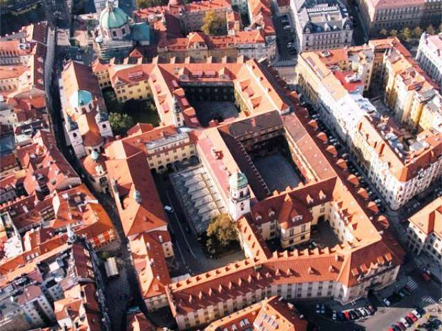

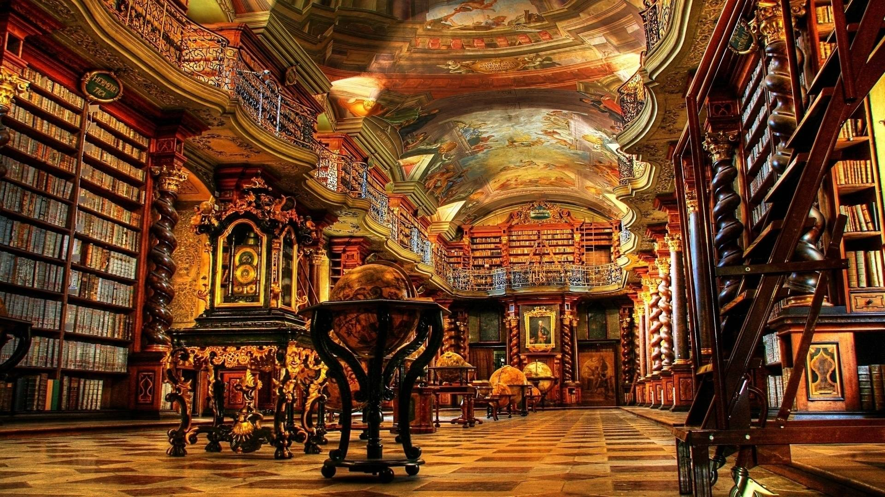

Het Klementinum is een voormalig jezuïetencollege in Praag. Nu huisvest het onder meer de Nationale Tsjechische Bibliotheek (Národní knihovna České republiky).

Het barokke gebouwencomplex van het Clementinum is het op een na grootste in Praag. Het kwam tot stand, nadat de jezuïetenorde zich in 1556 op uitnodiging van keizer Ferdinand I in de stad had gevestigd. Zij werden aanvankelijk in een dominicanerklooster gehuisvest dat de naam van paus Clemens I droeg. In 1616 kreeg het Clementinum de status van universiteit. In 1654 werd het Clementinum samengevoegd met de Karelsuniversiteit.

De bouw van het huidige Clementinum was in 1653 begonnen en zou tot 1722 duren: voor het complex moest een hele buurt wijken. Het omvat onder meer de Sint-Clemenskerk en de Sint-Salvatorkerk, een barokke bibliotheekzaal en een sterrenwacht. Na de liquidatie van de jezuïetenorde in 1773 kwam het gebouw in staatshanden. Sinds 1781 is de Nationale Bibliotheek er gevestigd.

In het Clementinum bevindt zich het eerste Mozarteum van de wereld: het dateert uit 1837. Ter ere van Mozart zijn er geregeld klassieke concerten in de Muziekkamer en in de Muziekkapel.

## Kostel Nejsvětějšího Salvátora (Sint-Salvatorkerk)

De Sint-Salvatorkerk is gelegen aan het Křižovnické náměstí (Kruisriddersplein), is een van de drie kerken in de Oude Stad gewijd aan Jezus in de vorm van verlosser (salvator mundi). De kerk staat vlak bij de Karelsbrug en is onderdeel van het voormalige jezuïetencollege Clementinum. De Sint-Salvatorkerk is gebouwd in barokstijl.

## Karlsbrug museum

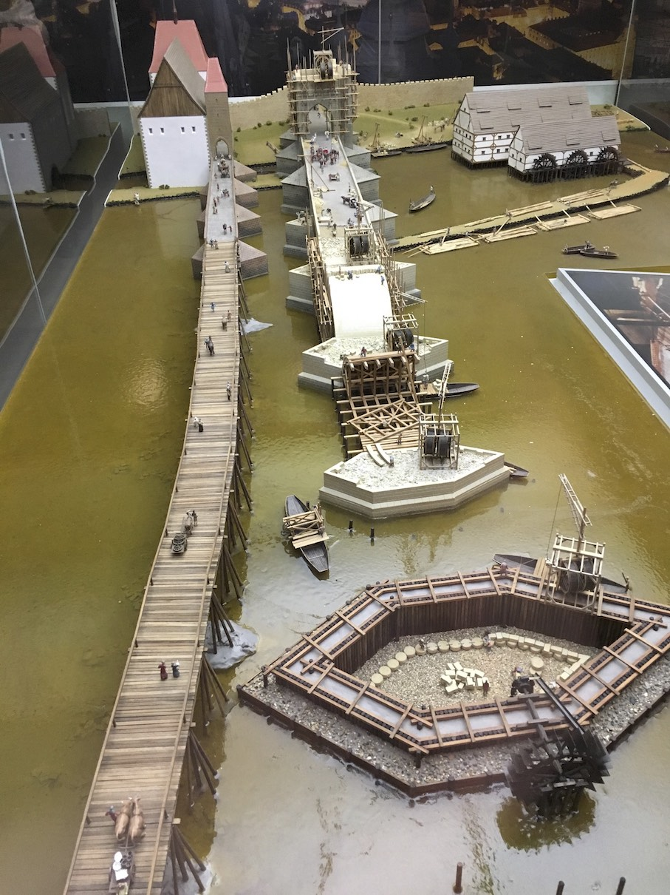

Op rechteroever aan de Karlsbrug, links van de Kostel svatého Františka z Assisi (Sint-Fransiscus kerk) 

## Muzeum Bedřicha Smetany (en monument)

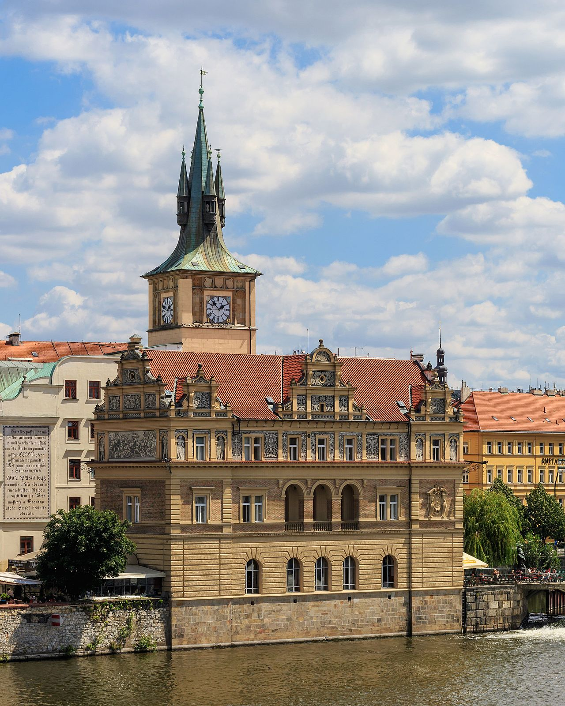

The Bedřich Smetana Museum (Muzeum Bedřicha Smetany) in Prague is a museum which is dedicated to the life and works of famous Czech composer Bedřich Smetana (1824–1884). It is situated in the centre of Prague in a small block of buildings right next to Charles Bridge on the right bank of the river Vltava in the Old Town (Novotného lávka 1, 110 00 Praha 1).

The building, which was formerly owned by Prague Water Company, has housed the Smetana Museum since 1936. It is a grand building in the Renaissance style. The main part of the museum exhibits are on the first floor. The upper floors house archive material relating to Smetana, providing a centre for research.

## Staroměstská vodárna (Oude watertoren)

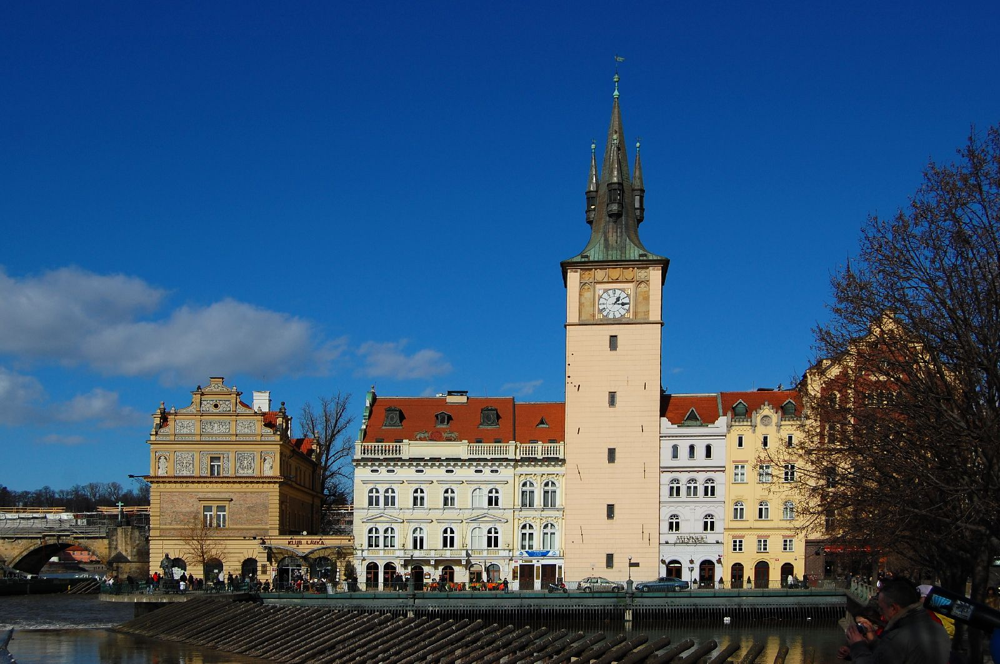

## Karlův Most (Karlsbrug)

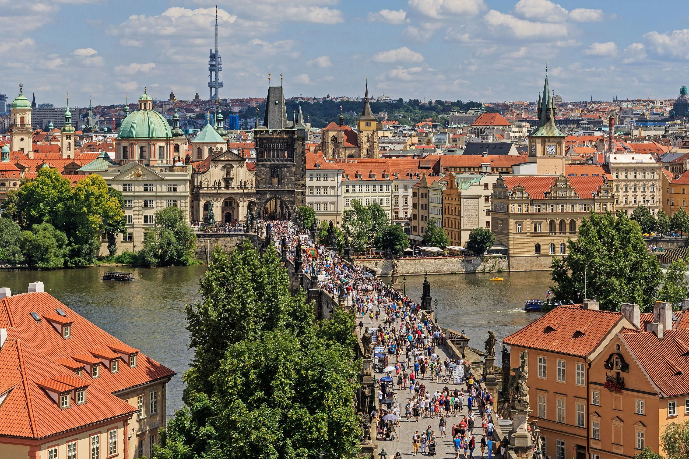

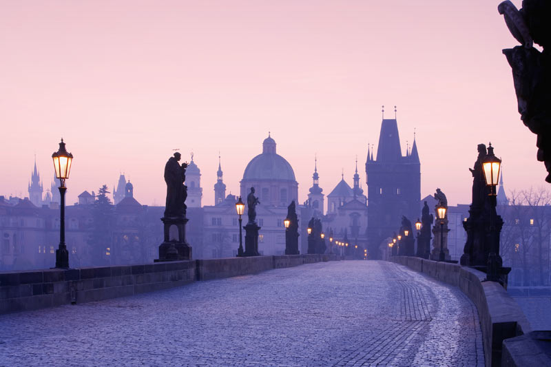

De Karelsbrug (Tsjechisch: Karlův most) is een beroemde brug over de Vltava (Moldau). De brug verbindt de Oude Stad met de wijk Malá Strana.

In 1357, op 9 juli, om 5.31 uur, legde koning Karel IV de eerste steen. Dat tijdstip komt overeen met het numerologische palindroom 135797531. De vorige brug, de Judithbrug uit de 12de eeuw, was in 1342 ingestort. Tot 1841 was de Karelsbrug de belangrijkste verbinding tussen de Oude Stad en de Praagse burcht. Oorspronkelijk heette de brug de Stenen Brug (Kamenný most), maar in 1870 werd dat Karelsbrug.

De brug is 516 meter lang en bijna 10 m breed. De constructie bestaat uit 16 bogen met ijsbeschermers. Het verhaal gaat dat door de mortel die voor de brug gebruikt is, eiwit gemengd werd om een grotere stevigheid te verkrijgen. De brug wordt beschermd door drie torens, waarvan 1 aan de zijde van de Oude Stad (de oostzijde). Deze toren wordt wel eens beschouwd als het mooiste gotische bouwwerk ter wereld.

Op de brug staan 30 standbeelden. De meeste zijn in de barokstijl en werden geplaatst tussen 1683 en 1714. Tot de bekendste beelden behoren dat van de priester en martelaar Johannes van Nepomuk en de beeldgroep van de "wrede Turk". De originele zandstenen beelden waren in de loop der tijden zo verweerd dat ze zijn vervangen door replica's. De originelen zijn te zien in het plaatselijke lapidarium.

De uitsluitend voor voetgangers toegankelijke brug is een van de belangrijkste bezienswaardigheden van Praag.

## Lennonova zeď (John Lennon Wall)

## Kostel sv. Mikuláše (Sint-Nicolaaskerk)

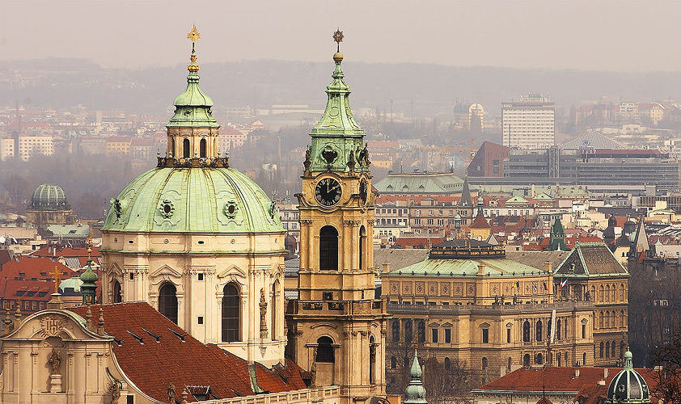

De Sint-Nicolaaskerk is een van de meestbezochte kerken in Praag. De in de wijk Malá Strana gelegen kerk is gewijd aan de heilige Nicolaas van Myra. De Sint-Nicolaaskerk staat aan het Malostranské náměstí (Plein van de Malá Strana). Door de 75 meter hoge koepel is de kerk een van de meest in het oog springende gebouwen van de wijk.

De kerk wordt gezien als een van de meest bezienswaardige barokke monumenten van Europa. De bouw van de Sint-Nicolaaskerk vond plaats tijdens de wederopbouw van de stad na de Dertigjarige Oorlog, in de tweede helft van de 17e eeuw. Dit was in de tijd dat de renaissancestijlen plaatsmaakten voor de barok. Zodoende is de Sint-Nicolaaskerk ook gebouwd in barokstijl.

De bouw begon in 1703 en werd uitgevoerd door Kryštof en Kilián Ignác Dientzenhofer. De kerk afgebouwd door Kilián’s schoonzoon Anselmo Lurago. Hij bouwde onder andere de klokkentoren. De koepel werd nog voltooid vlak voor Kilián’s dood.

Het interieur heeft beelden en versieringen in marmer en goud en fresco’s. Op het plafond van het schip schilderde Jan Lukáš Kracker een fresco over het leven van Sint Nicolaas met een oppervlakte van 1500 m². Op het plafond van de koepel schilderde Franz Palko de Viering van de Heilige Drie-eenheid.

## Pražský hrad (Praagse burcht)

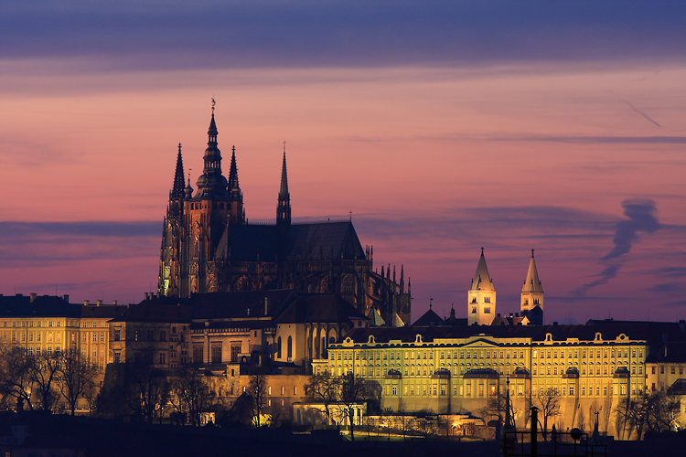

De Praagse burcht (Pražský hrad), ook wel Burcht van Praag of Kasteel van Praag genoemd, is een burcht op de heuvel en burchtwijk Hradčany. Het omsloten burchtgebied is het grootste ter wereld en werd in de 9e eeuw gebouwd.

De originele Praagse burcht stamt uit 880 en is gesticht door Borovoj, de oudst bekende vorst van de Przemysliden. De huidige gebouwen zijn in drie stijlperioden verankerd: romaans, gotiek en classicisme. Het begin werd gemaakt door vorst Wenceslaus I. Op de "Heuvel der Goden" liet hij in 925 een rond gebouw als veilige schrijn voor de hand van Sint-Vitus bouwen. De met houten palen omheinde vesting werd in de 11e eeuw door koning Bretislav I door een stenen burcht vervangen.

De Praagse burcht vormt tegenwoordig een van de grootste gesloten paleizencomplexen ter wereld. Alleen de voorzijde is al een halve kilometer lang. De burcht is de grootste burcht ter wereld, met een oppervlakte van 7,5 ha.

De Praagse burcht en omgeving bestaat uit diverse binnenpleinen, kerken en paleizen zoals onder andere:

* Praagse burcht
* Sint-Vituskathedraal
* Koninklijk paleis van Praag (Starý královský palác en Nový královský palác)
* Hradčanské náméstí (Hradčanyplein of Burchtplein)
* Swarzenberský palác (Schwarzenbergpaleis)
* Sternberský palác (Sternbergpaleis) met de Nationale Galerie
* První nádvoří (Eerste binnenplaats)
* Druhé nádvoří (Tweede binnenplaats)
* Derde binnenplaats
* Matyášova brána (Matthiaspoort)
* Obrazárna Pražského hradu (Schilderijengalerie van het Praagse kasteel)
* Informační středisko pražského hradu (Informatiecentrum van het Praagse kasteel)
* Sint-Jorisbasiliek
* Gouden Straatje
* Lobkowiczpaleis

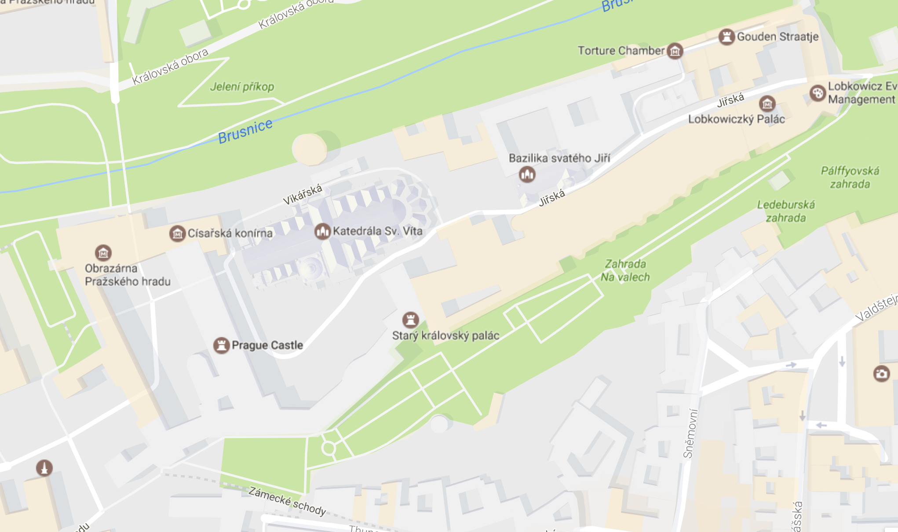

## Katedrála Sv. Víta

De Sint-Vituskathedraal (Tsjechisch: Katedrála svatého Víta) ligt in Praag, en is onderdeel van de Praagse burcht. De kerk is gewijd aan de heilige Vitus. De volledige naam van de kerk is Katedrála svatého Víta, Václava a Vojtěcha, oftewel Kathedraal van de heilige Vitus, Wenceslaus en Adalbert.

In het jaar 926 werd een eerste kerk in romaanse stijl gebouwd op deze locatie op de burchtheuvel. Keizer Karel IV gaf de opdracht om deze kerk te vervangen door wat de grootste kathedraal van Europa moest worden. De eerste steen werd in 1344 door de keizer persoonlijk gelegd. Als bouwheer was de Fransman Matthieu d'Arras aangesteld, die de bouw in de stijl van de Franse gotiek begon. Na zijn dood in 1352 werd hij als hofarchitect opgevolgd door de Duitser Peter Parler, die in Praag ook de Karelsbrug en de Týnkerk heeft ontworpen. Parler bouwde verder aan de Sint-Vitus in een Duitse gotische stijl.

Na zijn dood in 1399 werd Parlers werk overgenomen door andere architecten. Ongeveer 600 jaar werd aan de Sint-Vituskathedraal gebouwd. De kathedraal is (mede daarom) in verschillende stijlen gebouwd: de bouw begon in 1344 met de gotische stijl. Laatgotische elementen werden er vooral onder de Jagiello-koning Vladislav II (1471-1516) aan toegevoegd. De huidige aanblik is te herleiden tot de bouwactiviteiten van keizerin Maria Theresia. Ze liet de burcht in 1753 grondig renoveren en paste de uiterlijke verschijningsvorm aan aan het Weense classicisme. Ten tijde van het opkomend Tsjechische nationalisme in de 19e eeuw werd de bouw hervat; uit deze periode dateert het schip. Er is tot 1929 gewerkt aan de voltooiing van de Sint-Vitus. Als laatste kwam het tweetorenfront gereed.

De invloed van de barok, bij uitstek de bouwstijl die gezichtsbepalend is voor Praag, is bij de Sint-Vitus beperkt gebleven tot het bovendeel van de grote zuidelijke toren. Verder valt de grote hoeveelheid versieringen op in de vorm van beeldhouwwerken op 30 meter hoogte. Het mozaïek boven een van de toegangspoorten beeldt het laatste oordeel uit. Behalve Jezus en Johannes de Doper zijn ook enkele Boheemse heiligen hierop afgebeeld. Ook is hier veel goud in verwerkt. Een invloed van de 20e eeuw zien we in de gebrandschilderde en in de glas-in-loodramen links. Een ervan is gemaakt door de Tsjechische jugendstilkunstenaar Alfons Mucha. Rechtsachter in de kerk bevindt zich in een afgeschermde ruimte de kapel van de heilige koning Wenceslaus, in Tsjechië Václav genoemd. Zijn tombe staat in het midden omringd door 14e-eeuws mozaïek ingelegd met edelstenen, en 16e-eeuwse schilderingen. Ook de patroonheilige van de kerk, de heilige Vitus, ligt hier begraven. Zijn overblijfselen liggen in het midden van de kerk in een zilveren kist. Het achterste gedeelte van de kerk is niet gratis te bekijken. Te zien zijn daar onder andere het Sint-Vitusaltaar, de relikwieënkapel en het hoofdaltaar. Min of meer als handtekening hangt er in de kerk ook de buste van Peter Parler zelf.

De Sint-Vituskathedraal heeft drie torens. De twee westelijke torens worden met hun 88 meter nog met 11 meter overtroffen door de hoofdtoren aan de zuidzijde (niet toegankelijk). Vanaf de hoofdtoren luidt bij bijzondere gelegenheden de grootste klok van Bohemen: 17 ton zwaar, 2 meter hoog, doorsnede 2,5 meter. De Sint-Vituskathedraal is het belangrijkste sacrale bouwwerk van de stad, ook vroeger, toen de Boheemse koningen in de 124 meter lange en 34 meter hoge domkerk gekroond werden. Hier bevinden zich ook de koningsgraven. Onder anderen liggen hier dochters van keizerin Maria Theresia.

## Starý královský palác (koninklijk paleis)

Het oude koninklijk paleis van Praag (starý královský palác) is een deel van de Praagse burcht. Het paleis omvat onder andere een grootse Ridderzaal en sierlijke tuinen die publiek toegankelijk zijn en door iedereen kunnen worden bezichtigd. Het paleis werd ooit gebouwd door prins Bořivoj I van Bohemen.

## Bazilika svatého Jiří (Sint-Jorisbasiliek)

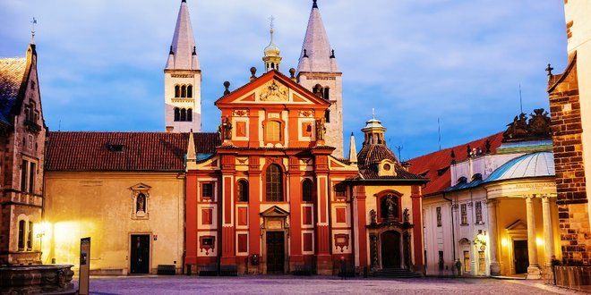

De Sint-Jorisbasiliek (Tsjechisch: Bazilika svatého Jiří) is een basiliek in de wijk Hradčany van de Tsjechische hoofdstad Praag. De basiliek is de oudste kerk binnen de Praagse burcht, waar ook de Sint-Vituskathedraal staat. Oorspronkelijk werd de kerk rond het jaar 920 gebouwd, waarmee het de tweede Christelijke kerk was binnen het gebied dat nu Praag heet. In de eerste helft van de 12e eeuw werd de kerk herbouwd in romaanse stijl. De barokke gevel van de Sint-Jorisbasiliek stamt uit de 17e eeuw.

Naast de kerk staat het Benedictijnse Sint-Jorisklooster. De basiliek zelf staat aan de oostkant van het náměstí U svatého Jiří (Plein bij de Sint-Joris). Aan hetzelfde plein bevinden zich nog twee andere kerken; de Sint-Vituskathedraal aan de westkant en de Allerheiligenkerk aan de zuidzijde.

## Lobkowiczký Palác (Lobkowiczký paleis)

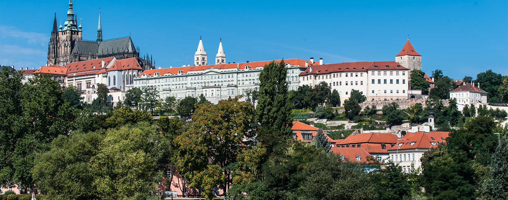

The Lobkowicz Palace (Czech: Lobkowický palác), the only privately owned building in the Prague Castle complex, is home to the Lobkowicz Collections and Museum, the Lobkowicz Palace Café, Midday Classic Concert and Museum Gift Shop, as well as numerous room venues for private functions.

The Lobkowicz Palace was built in the second half of the 16th century by the Czech nobleman Jaroslav of Pernštejn (1528–1569) and completed by his brother, Vratislav of Pernštejn (1530–1582), the chancellor of the Czech Kingdom. After undergoing a variety of renovations and a fruitful history, it was opened to the public for the very first time on 2 April 2007 as the Lobkowicz Palace Museum.

## Zlatá ulička (Gouden straatje)

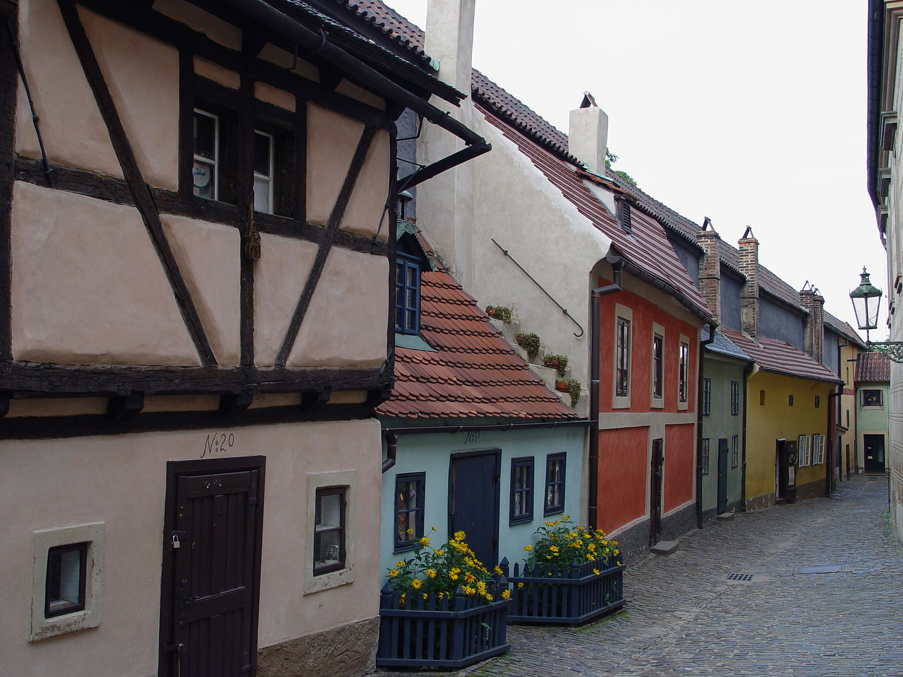

Het Gouden Straatje (soms ook Gouden Steegje, Tsjechisch: Zlatá ulička u Daliborky) is een smal straatje aan de binnenzijde van de noordelijke muur van de Praagse burcht. Het eeuwenoude straatje is een van de grootste toeristische trekpleisters van de stad.

De naam van het straatje duikt voor het eerst op in de 16e eeuw. De elf huisjes werden gebouwd als onderkomen voor de kasteelwachten. Later werd het straatje ook door andere kasteelbedienden bewoond. Een verklaring van de naam is dat onder die bedienden goudsmeden waren. Een andere uitleg van de naam is afkomstig uit een legende. Keizer Rudolf II zou alchemist zijn geweest. Volgens de legende zouden zijn pogingen tot het maken van goud hebben plaatsgevonden in het Gouden Straatje.

Tussen 1916 en 1917 werd huis nummer 22 bewoond door de bekende Duitstalige schrijver Franz Kafka. Tegenwoordig doen de huisjes aan het Gouden Straatje geen dienst meer als woonhuis. In de gebouwen zijn voornamelijk souvernirwinkels en cafés ondergebracht. Het huis van Kafka is tegenwoordig een klein museum met boekwinkel.

## Folterkamer

## Letenské sady (Letnápark)

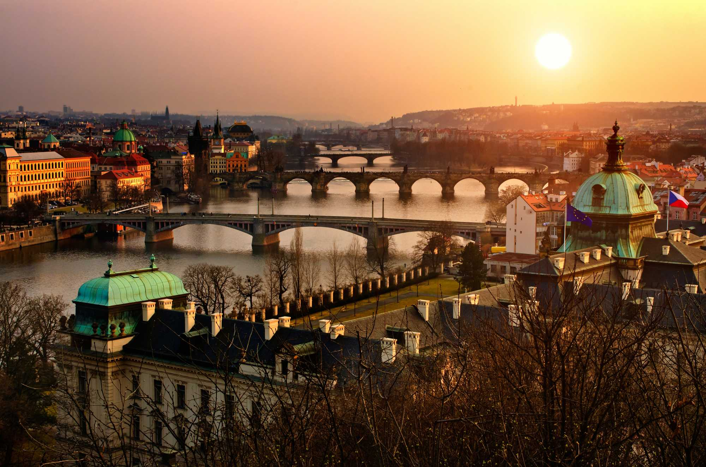

De Letna heuvel ligt ingeklemd tussen de wijken Hradcany en Holesovice in de bocht van de Moldau. Een lommerrijk park en in de zomer het domein van wandelaars, joggers, fietsers en skaters. Dwarrelende bladeren en dikke vlokken sneeuw zorgen ervoor dat het Letna park ook aantrekkelijk is in de herfst en de winter. Komt het voorjaar dan verschijnen de narcissen en tulpen. 

Tot 1989 vonden hier de meimarsen en militaire parades plaats. Duizenden Tsjechen marcheerden langs het Sparta-stadion aan de kant van de Milady Horakovastraat om hun communistiche leiders te eren.

*Nadien terug de Moldau oversteken en door de oude stad terug richting hotel.*
