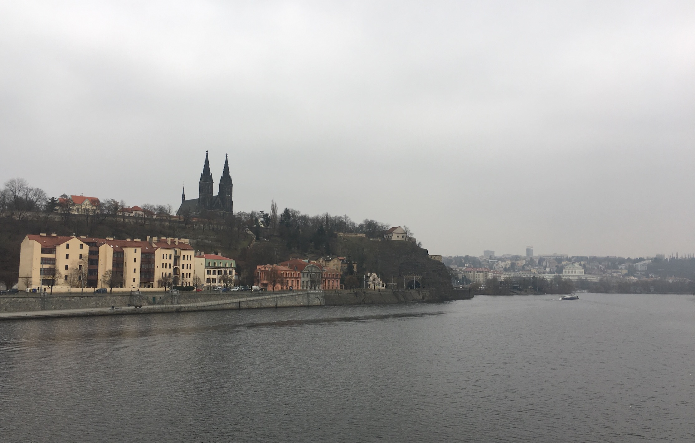
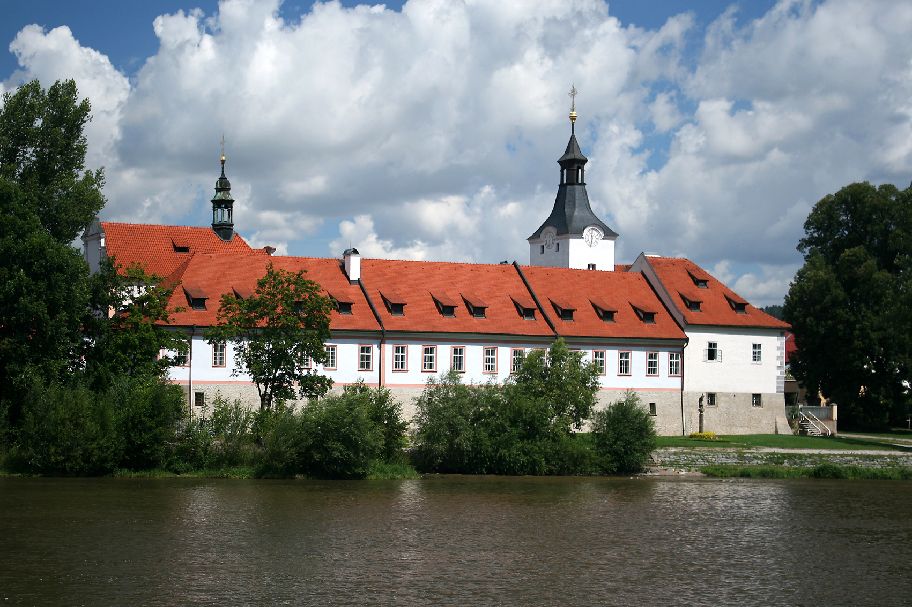

## Vyšehrad

Als je de trein neemt in Praha-Smichov dan moet je zeker eerst langs Vyšehrad wandelen!

Vyšehrad (Tsjechisch voor 'hoge burcht') is een wijk van de Tsjechische hoofdstad Praag die ten zuiden ligt van de Oude Stad. Het is een toeristische vestingstad met metershoge muren en stadspoorten. Een bekende bezienswaardigheid in de wijk, is de Sint-Petrus-en-Pauluskerk (Kostel sv. Petra a Pavla).

De vesting is in de 10e eeuw door de Přemysliden gesticht en later in romaanse en gotische stijl uitgebreid. Het tegenwoordige uiterlijk wordt bepaald door barokelementen.

Op het kerkhof van Vyšehrad werden onder meer Antonín Dvořák en Bedřich Smetana begraven.

## Karlstejn

Kasteel Karlstein (Tsjechisch:hrad Karlštejn) is een 14e-eeuws gotisch kasteel in Karlštejn in Tsjechië, zo'n 20 km westelijk van Praag.

Het kasteel werd gebouwd in 1348 in opdracht van Karel IV, koning van Bohemen en keizer van het Heilige Roomse Rijk. Het was bedoeld als bewaarplaats voor de kroonjuwelen, heilige relikwieën en de rijksschatkist.

Het meest in het oog springende deel van het kasteel is de 60 meter hoge grote toren, die wel binnen de kasteelmuren staat, maar verder niet met de andere gebouwen van het kasteel is verbonden. Deze toren staat op het hoogste punt van de heuvel en bevat de kapel van het heilige kruis. Iets lager staat de Marian (mindere) toren, die de schatkist bevatte. Ook deze toren staat apart van de andere gebouwen. Op de tweede verdieping liggen de kapellen van de heilige maagd en Sint Catharina. Het keizerlijke paleis ligt aan de zuidoostelijke zijde van het kasteel tegen de buitenmuur. Van daaruit loopt een uitstulping van de muur naar het zuidwesten, waar zich in de zuidelijkste toren de waterput bevindt.

*Zoek zeker eerst de openingsuren op, want in de winter is Karlstein bv enkel open in het weekend.*

### Oriëntatie
Vanaf het station is het ongeveer 10 minuten lopen naar het dorp. Je verlaat links het station, steekt de rivier over en gaat rechtsaf. Als je eenmaal op de parkeerplaats van het dorp bent is het ongeveer 1 km tot het kasteel, onderweg passeer je verschillende kristal en souvenirwinkeltjes.

### Daar komen
35 km van ten zuidwesten van Praag. Je kan de trein nemen naar Beroun van Hlavní Nádraží (centraal station) of Praha-Smíchov en uitstappen bij Karlštejn (40 minuten, vertrekt elk uur). Kaartjes kosten ongeveer 60 CZK.

## Lom Velká Amerika

Velká Amerika (Big America, Czech Grand Canyon) is a partly flooded, abandoned limestone quarry near Mořina village, in the Central Bohemian Region of the Czech Republic (in Beroun District).  
It is 800 metres long, 200 metres wide and 80 to 100 metres deep with an 18-metre deep lake on the bottom.  
Mining of the limestone was conducted in the first half of the 20th century. There are other quarries nearby, one of those is Malá Amerika (Small America) about 1.3km to the west. The quarries are connected with each other by long tunnels.  
The place has several times been used by Czech filmmakers. The place is sought after by professional divers and also popular spot for tourists on their trip to the Karlštejn Castle.

### Dobřichovice

Dobřichovice is een stadje in de Tsjechische regio Midden-Bohemen, en maakt deel uit van het district Praha-západ. Dobřichovice ligt 20 kilometer ten zuidwesten van Praag in de Tsjechische Karst (Cesky kras), een gebied met veel druipsteengrotten. Dobřichovice telt 3034 inwoners.

De rivier de Berounka stroomt door Dobřichovice.
 
Het dorpje heeft enkele restaurantjes
