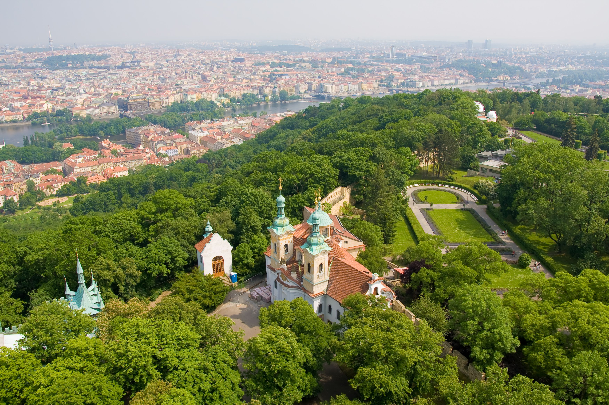

## Via Karlův Most naar toeristische dienst  

De Karelsbrug (Tsjechisch: Karlův most) is een beroemde brug over de Vltava (Moldau) in Praag. De brug ligt in het district Praag 1 en verbindt de Oude Stad met de wijk Malá Strana.

In 1357, op 9 juli, om 5.31 uur, legde koning Karel IV de eerste steen. Dat tijdstip komt overeen met het numerologische palindroom 135797531. De vorige brug, de Judithbrug uit de 12de eeuw, was in 1342 ingestort. Tot 1841 was de Karelsbrug de belangrijkste verbinding tussen de Oude Stad en de Praagse burcht. Oorspronkelijk heette de brug de Stenen Brug (Kamenný most), maar in 1870 werd dat Karelsbrug.

De brug is 516 meter lang en bijna 10 m breed. De constructie bestaat uit 16 bogen met ijsbeschermers. Het verhaal gaat dat door de mortel die voor de brug gebruikt is, eiwit gemengd werd om een grotere stevigheid te verkrijgen. De brug wordt beschermd door drie torens, waarvan 1 aan de zijde van de Oude Stad (de oostzijde). Deze toren wordt wel eens beschouwd als het mooiste gotische bouwwerk ter wereld.

Op de brug staan 30 standbeelden. De meeste zijn in de barokstijl en werden geplaatst tussen 1683 en 1714. Tot de bekendste beelden behoren dat van de priester en martelaar Johannes van Nepomuk en de beeldgroep van de "wrede Turk". De originele zandstenen beelden waren in de loop der tijden zo verweerd dat ze zijn vervangen door replica's. De originelen zijn te zien in het plaatselijke lapidarium.

*Over Karlsbrug wandelen tot aan toeristische dienst. Deze is voorbij de Malostranská mostecká věž.*

## Doorheen tuinen van Vojanovy sady en Valdštejnská zahrada 

*Van daaruit kan je verder doorheen de parken terug naar de Oude Stad.*

Vojanovy sady wordt beschouwd als de oudste gedeeltelijk bewaard gebleven tuin in Praag. De sfeer van contemplatie heeft voor zover bekend geduurd vanaf de middeleeuwen, toen het werd aangelegd als een monastieke tuin. Hier vindt u wat rust weg van de drukte van de grote stad, waar u kunt verpozen op een bankje bij het zwembad, in de schaduw van volgroeide bomen.

Valdštejnská zahrada, Wallensteintuin, is een sieraad van de Praagse barok. Bronzen godenstandbeelden sieren de allée die naar het pronkstuk van de tuin leidt; de Sala Terrena, een loggia met drie bogen en rijkelijk versierd met fresco's. De beelden werden vervaardigd door de Zuid-Nederlandse beeldhouwer Adriaen de Vries die zich ten tijde van Rudolf II in Praag vestigde.

## Valdštejnský paleis en Národní gallerij

Het Valdštejnský paleis (Wallenstein Paleis) is gebouwd in opdracht van Albrecht Vaclav Eusebius von Wallenstein, één van de meest invloedrijke en vermogende edelmannen. In 1630 kocht hij 23 huizen, drie tuinen en de Praagse steenbakkerij op om de, in zijn ogen, perfecte locatie te krijgen. Het immense paleis is ontworpen door Italiaanse architecten. Net zo mooi als het paleis is de tuin. Er staan bronzen beelden en een kunstmatige grot, inclusief stalactieten en vleermuizen. Achter in de tuin ligt nog een siervijver en een rijschool met stallen, waar nu tentoonstellingen van de Nationale Galerie worden gehouden.

De Nationale Galerie Praag (Národní galerie v Praze) is een Tsjechisch nationaal museum voor schilderkunst en beeldhouwkunst, gevestigd aan diverse locaties in Praag.

## Oude Stad 

*Over de Mánesův brug wandelen we terug naar de oude stad.*

*Voor we het oude stadsplein zien, kom je nog bezienswaardigheden tegen op rechteroever:*

#### Rudolfinum

Het Rudolfinum is een concertgebouw in de Oude Stad van de Tsjechische hoofdstad Praag. Het is een van de belangrijkste gebouwen in neo-renaissancestijl van de stad. Het gebouw, gelegen aan het Jan Palachplein aan de oever van de Moldau, is het thuispodium van het Tsjechisch Filharmonisch Orkest. Het Rudolfinum is daarnaast een van de hoofdpodia van het jaarlijks gehouden Praagse Lente-festival.

Het concertgebouw is ontworpen door de architecten Josef Zítek en Josef Schulz. Het gebouw werd geopend op 8 februari 1885 en werd genoemd naar Rudolf van Oostenrijk. Tussen 1918 en 1939 was het Rudolfinum het gebouw van het Tsjechoslowaakse parlement.

### Starý židovský hřbitov (Joods kerkhof)

De Oude Joodse Begraafplaats (Tsjechisch: Starý židovský hřbitov) is de oudste nog bestaande joodse begraafplaats van Europa. De begraafplaats ligt in de wijk Josefov in de Tsjechische hoofdstad Praag. De begraafplaats was in gebruik van 1478 tot 1786. Tegenwoordig is het onderdeel van het Joods Museum.

Het aantal mensen dat op deze begraafplaats begraven ligt is niet vast te stellen, omdat er op sommige plaatsen meerdere lagen (12) van graven boven elkaar liggen. Ondanks de kleine oppervlakte van ongeveer één hectare wordt het aantal grafstenen op ongeveer 12.000 geschat. Vermoedelijk liggen er echter lichamen van zo'n 100.000 mensen. Een aantal bekende personen die hier zijn begraven zijn Jehoeda Löw (overleden 1609), Mordecai Meisel (1601) en David Gans (1613).

### Kostel sv. Ducha (Kerk van Heilige Geest)

De Heilige Geestkerk (Tsjechisch: Kostel svatého Ducha) is een kerk in de Oude Stad van de Tsjechische hoofdstad Praag. De kerk is in de tweede helft van de 14e eeuw gebouwd in gotische stijl. De aan de Heilige Geest gewijde kerk staat aan de straat Dušní.

### Spaanse synagoge

De Spaanse Synagoge (Spanělská Synagóga) in Stare Mesto is in 1868 gebouwd op de plaats waar vroeger de oudste synagoge van Praag stond. Het huidige 19de-eeuwse gebouw is gebouwd in de Moorse stijl en het sierpleisterwerk doet een beetje denken aan het Alhambra in Granada. In de synagoge vind je een museum over de geschiedenis van de Tsjechische Joodse Gemeenschap tijdens de periodes van verlichting en emancipatie. De gemeenschap van de Spaanse Synagoge is erg open en ze vinden het dan ook geen probleem als er nieuwe mensen in de zaal zitten.

## Staroměstské náměstí (Stadsplein Oude Stad)

Het Staroměstské náměstí (uitspraak: Geluidsfragment Staroměstské náměstí (info / uitleg), Tsjechisch voor "plein van de oude stad") is een plein in het stadsdeel Oude Stad van de Tsjechische hoofdstad Praag. Het meer dan 9000 m² plein is vooral 's zomers populair onder toeristen.

Naast de imposante gevels van burgerlijke gebouwen staan er aan het plein kerken in verschillende stijlen, waaronder de Týnkerk in gotische stijl en de barokke Sint-Nicolaaskerk.

Ook het Oudestadraadhuis (Staroměstská radnice), met er naast het Astronomisch uurwerk van Praag, is aan het plein te vinden. Midden op het plein staat een standbeeld van de religieuze hervormer Johannes Hus. Dit standbeeld is opgericht op 6 juli 1915, 500 jaar na de dood van Hus.

Bezienswaardigheden rondom het oude stadpslein:

### Chrám Matky Boží před Týnem (Týnkerk)

De Týnkerk (Tsjechisch: Týnský chrám, voluit Kostel Matky Boží před Týnem) is een 14e-eeuwse kerk.

De kerk, met twee tachtig meter hoge torens, is gevestigd aan het Oudestadsplein in het centrum van de Oude Stad.

In de 11e eeuw stond er op de plaats van de huidige Týnkerk een romaanse kerk, die in 1256 werd vervangen door een vroeggotische kerk. De bouw van de huidige kerk begon in de 14e eeuw in laatgotische stijl. Aan het begin van de 15e eeuw was de bouw bijna gereed, alleen de torens, het frontaal en het dak ontbraken nog. Rond 1450 was het dak van de kerk gereed, enige tijd later waren ook het frontaal en de noordelijke toren gebouwd.

In 1679 werd de kerk getroffen door een grote brand. Een groot deel van de voorgevel werd later gerestaureerd.

### Palác Kinských (Kinský paleis)

Kinský Palace (Czech: Palác Kinských) is a former palace and now an art museum. It is located on Old Town Square in the Old Town area of Prague. The palace's name refers to its former ownership by the Kinský noble family.

The palace was originally built for the Golz family between 1755 and 1765. As a result, the palace is also known as Golz-Kinský Palace (Palác Golz-Kinských).

The building was designed by Kilian Ignaz Dientzenhofer and is Rococo in style. The exterior is stucco and is painted in pink and white. There are statues by Ignaz Franz Platzer on the exterior, which are of the classical elements. In 1768, the Kinský family purchased the home from the Golz family.

Franz Kafka's father, Hermann Kafka, was a haberdasher. He had his store at the palace, which was located on the ground floor. Franz Kafka attended secondary school at the palace, from 1893 until 1901.

### Chrám svatého Mikuláše (Sint-Nicolaas kerk)

The Church of Saint Nicholas (Czech: Kostel svatého Mikuláše) is a Late-Gothic and Baroque church in the Old Town of Prague. It was built between 1732-1737 on the site of a Gothic church from the 13th century which was also dedicated to Saint Nicholas.

The church was formerly used by the Czech and Slovak Orthodox Church. Since 1920 it has been the main church of the Czechoslovak Hussite Church and its Prague diocese.

### Pražský orloj (Astronomlische klok)

Het astronomische uurwerk van Praag (Tsjechisch: Staroměstský orloj of Pražský orloj) is een middeleeuws astronomisch uurwerk in het centrum van de Tsjechische hoofdstad Praag. Het uurwerk is bevestigd aan de zuidelijke muur van het Oudestadsraadhuis aan het Oudestadsplein in de Oude Stad van Praag.

Het geheel bestaat uit drie hoofdonderdelen.

Het eerste onderdeel in het midden, de astronomische wijzerplaat, geeft de tijd aan en laat de stand van de zon en de maan zien. Het uurwerk geeft vijf soorten tijd aan:

1. de plaatselijke tijd van Praag,
1. de tijd, gemeten in een verdeling van 12 uren tussen zonsopgang en zonsondergang; de zogenaamde ongelijke uren. Zij zijn van dag tot dag langer of korter omdat de periode tussen zonsopgang en zonsondergang elke dag verschilt,
1. de tijd, gemeten in een verdeling van 24 uren die aangeeft hoelang de zon verwijderd is van het moment van zonsondergang, de zogenaamde Boheemse of Italiaanse uren,
1. de plaats van de zon in de zodiak of dierenriem,
1. de sterrentijd.

Het uurwerk bestaat uit drie schijven: de vaste schijf in het midden en de onafhankelijk daarvan draaiende buitenrand en zodiakring. Er zijn drie wijzers: de wijzer met het handje, het zonnetje dat op die wijzer heen en weer schuift en de wijzer met het sterretje die vast verbonden is met de zodiakschijf.

Het tweede onderdeel bovenaan is de Parade van de Apostelen. Elk uur gaan er twee kleine deuren open en komt er een parade van apostelen voorbij.

Het derde onderdeel onderaan is een wijzerplaat met medaillons die de maanden voorstellen en waarop voor elke dag de heilige wordt aangeduid.

Het oudste deel van het uurwerk stamt uit het begin van de 15e eeuw. De apostelen zijn echter pas in 1865 toegevoegd. Volgens een legende werd de maker van het uurwerk in Praag, toen het uurwerk klaar was, blind gemaakt opdat hij een dergelijk uurwerk niet meer zou kunnen maken voor een andere stad.
