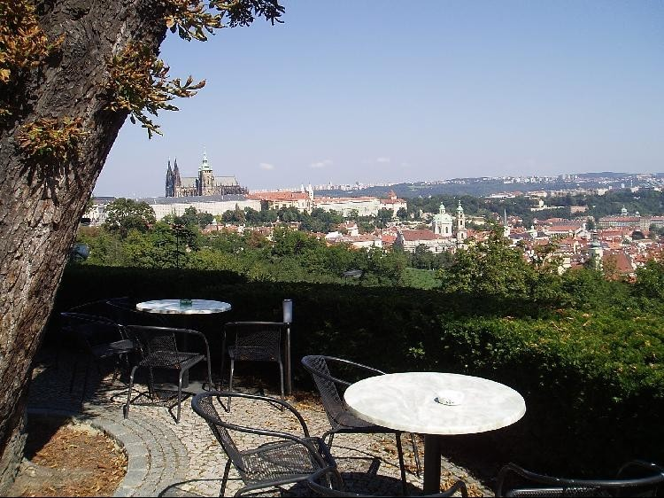
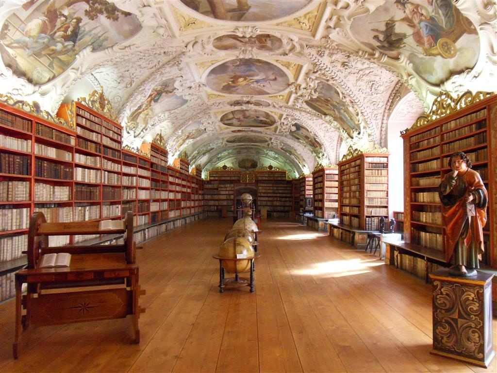
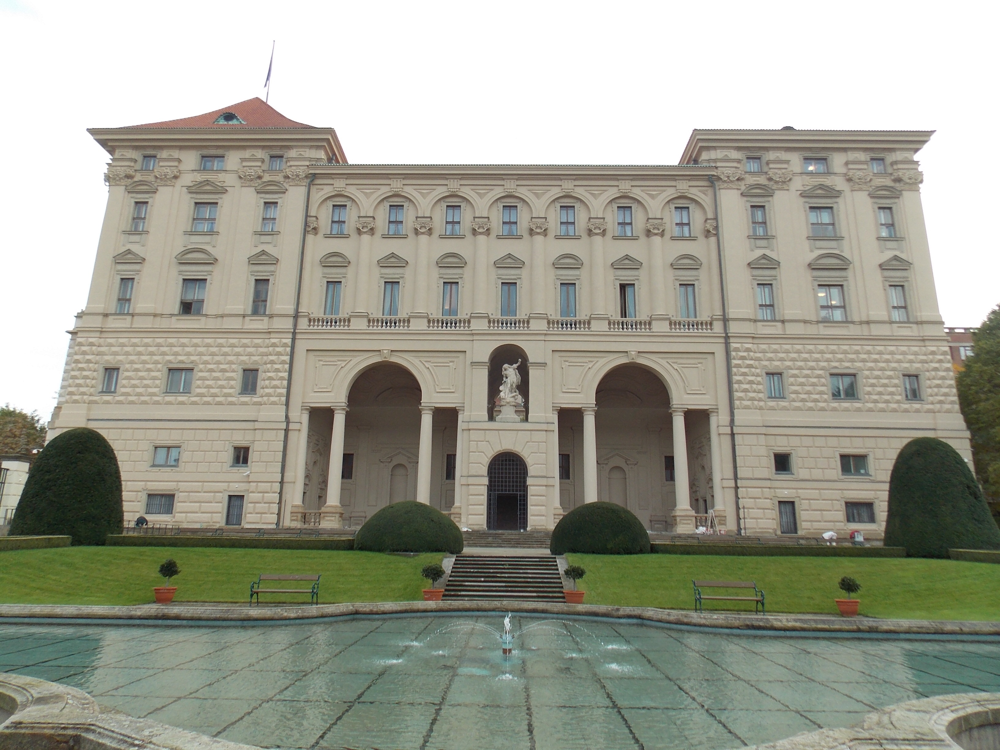

*Vertrekken langs legioenen brug: Most Legii*

## Uitzicht vanop Petřín-uitkijktoren

De Petřín-uitkijktoren (Tsjechisch: Petřínská rozhledna) is een 60 meter hoge stalen constructie in de Praagse wijk Malá Strana, welke veel op de Eiffeltoren lijkt. Hoewel de toren veel korter is dan de Eiffeltoren zijn de toppen op vrijwel dezelfde hoogte omdat de toren boven op de heuvel Petřín staat.

De toren werd gebouwd in 1891 en werd in eerste instantie gebruikt als observatietoren en zendmast. Tegenwoordig is de uitkijktoren een van de belangrijkste toeristische attracties van Praag. Vlak bij de toren staat het spiegelpaleis (Bludištì).

Open 10:00 - 18:00  
Prijs: 59 CZK student, 120 CZK normaal

## Restaurant Nebozízek

Een erg populair restaurant in Praag is het Nebozízek restaurant. Wil je tijdens het eten ook jouw ogen eens de kost geven, dan is dit restaurant een aanrader. Van het terras is het uitzicht immers heel mooi. Reserveren is aangeraden!

[http://www.nebozizek.cz/en/](http://www.nebozizek.cz/en/)

## Strahov Klooster

*Het Strahovklooster werd oorspronkelijk gebouwd in het jaar 1140. Het is voornamelijk bekend om zijn prachtige bibliotheek. Deze is overdadig verfraaid met prachtige fresco's en bevat een verzameling van meer dan 200.000 boeken.*

In 1140 liet koning Vladislav II een nieuw klooster bouwen op de toegangsweg naar de Praagse Burcht. Het klooster, dat de naam Strahovklooster kreeg, was geen groot succes tot in 1143, toen een groep premonstratenzers zich hier kwam vestigen.
De premonstratenzers zijn een Rooms-katholieke kloosterorde van kanunniken die gesticht werd in 1120 door Sint-Norbertus. Ze worden ook wel norbertijnen genoemd.

Het nieuwe klooster begon al snel op te bloeien en in korte tijd werd het een intellectueel en spiritueel centrum. Tegen het einde van de twaalfde eeuw waren de meeste oorspronkelijk in hout opgetrokken gebouwen vervangen door stenen gebouwen in romaanse stijl. 

Het klooster werd herbouwd in gotische stijl nadat het complex in 1258 vernield werd door een brand. Het bleef welvarend tot in 1420 toen het geplunderd werd door Hussieten. Het verval zette zich in en duurde tot aan het einde van de zestiende eeuw, toen de meeste gebouwen werden gerenoveerd. Het klooster werd opnieuw geplunderd tijdens de Dertigjarige Oorlog (1618-1648). 

In de loop van de zeventiende en achttiende eeuw werd het klooster uitgebreid, ditmaal in de barokstijl. Na een bombardement door het Franse leger in 1742 werden de meeste middeleeuwse gotische gebouwen heropgebouwd in barokstijl.

[http://www.strahovskyklaster.cz/en/](http://www.strahovskyklaster.cz/en/)

## Loreta heiligdom

Loreto is een pelgrimsoord in Praag dat oorspronkelijk in 1626 werd gebouw en later werd uitgebreid tot het barokcomplex dat we nu zien. Het werd gebouwd in opdracht van Caroline Lobkowicz, die geobsedeerd was door het Heilig Huis in Loreto, Italië.

De prachtige 17e eeuwse Loreta kerk en haar bijbehorende kapellen zijn een kopie van de Santa Casa kerk in het Italiaanse plaatsje Loreto. Een aanrader is om een kijkje te nemen in de schatkamer. Hier bevinden zich 300 museumstukken, waaronder waardevolle gewaden, sieraden, schalen en vazen. Bewonder de 6.222 diamanten schitterend op een zilveren monstrans uit 1698. Hou er bij je bezoek rekening mee dat het Loreta Heiligdom tussen 12.15 en 13.00 uur gesloten is.

9u30 tot 16u
110 CZK studenten

## Černínského paleis (met tuinen) en Panny Marie Andělské kerk

The Czernin Palace (Czech: Černínský palác) is the largest of the baroque palaces of Prague, which has served as the offices of the Czechoslovak and later Czech foreign ministry since the 1930s. It was commissioned by the diplomat Humprecht Jan Černín z Chudenic, the Habsburg imperial ambassador to Venice and Rome, in the 1660s.

The palace features stuccos by Italian artists.

In 1666, Humprecht Jan Černín purchased a part of the debt loaded property of the House of Lobkowicz, including a building plot with gardens located in the centre of Prague. In 1668, he commissioned Francesco Caratti, a Swiss-Italian architect, and assigned him to develop the project of his new palace on the site. The next year, building contractors Gione Decapaoli and Abraham Leuthner started construction. The plasterers Giovanni Maderna and Giovanni Battista Cometa were replaced by Francesco Peri and Antonio Travelli in 1674.
